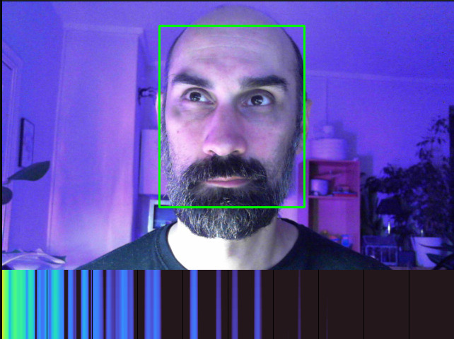

# Remote Photoplethysmography (rPPG) / Heart Rate Monitoring through Color Channel Analysis

An experiment in measuring heart beat rates by observing color channel variations over time.

## Interbeat Interval (IBI) and Heart Rate Variability (HRV)

> The interbeat interval, also known as the heart rate or pulse, refers to the time between successive heartbeats.
> It is typically measured in beats per minute (bpm). The heart rate can vary depending on factors such as age,
> physical activity, emotional state, and overall health. Here are some typical interbeat intervals for
> different age groups:

> Heart Rate Variability (HRV) is the variation in time between successive heartbeats. It is an essential measure
> of the autonomic nervous system's activity and overall cardiac health. HRV is typically assessed by analyzing
> the time intervals between R-peaks (R-R intervals) in an electrocardiogram (ECG) or heart rate data.
> HRV can be quantified in various ways, and different metrics may be used to assess it. One common metric is the
> standard deviation of normal R-R intervals (SDNN).

1. Newborns (0–1 month):
   * Interbeat Interval: 600–375 ms
   * Frequency: 1.67–2.67 Hz (100–160 bpm)
   * Variability: 50–100 ms
2. Infants (1–12 months):
   * Interbeat Interval: 666–375 ms
   * Frequency: 1.5–2.67 Hz (90–160 bpm)
   * Variability: 80–120 ms
3. Toddlers (1–2 years):
   * Interbeat Interval: 750–462 ms
   * Frequency: 1.33–2.17 Hz (80–130 bpm)
   * Variability: 70–110 ms
4. Preschoolers (3–5 years):
   * Interbeat Interval: 750–500 ms
   * Frequency: 1.33–2 Hz (80–120 bpm)
   * Variability: 70–100 ms
5. Children (6–12 years):
   * Interbeat Interval: 857–545 ms
   * Frequency: 1.17–1.83 Hz (70–110 bpm)
   * Variability: 70–100 ms
6. Adolescents (13–19 years):
   * Interbeat Interval: 1000–600 ms
   * Frequency: 1–1.67 Hz (60–100 bpm)
   * Variability: 60–100 ms
7. Adults (20 years and older):
   * Interbeat Interval: 1000–600 ms
   * Frequency: 1–1.67 Hz (60–100 bpm)
   * Variability: 20–70 ms
